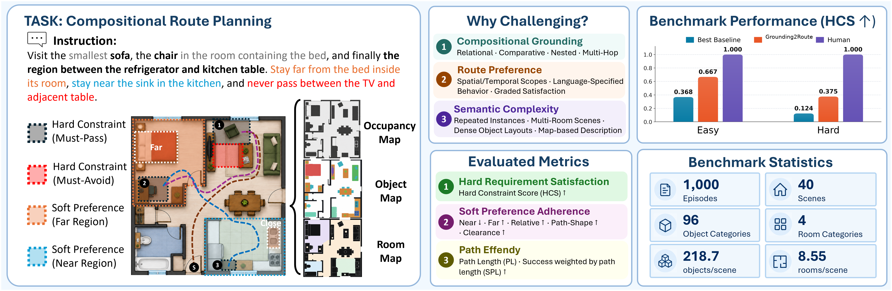
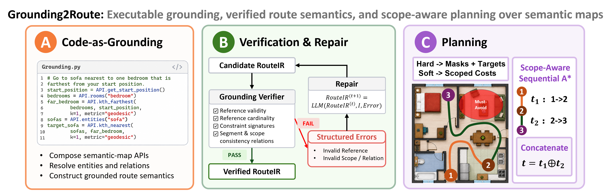

# Map2Route: Benchmarking Compositional Language-Grounded Route Planning over Semantic Maps

[**Paper**](./Map2Route.pdf) | [**Anonymous Github Repo**](https://anonymous.4open.science/r/Map2Route-F05F/README.md) | [**Anonymous Project Page**](https://anonymous.4open.science/w/Map2Route-F05F/)



<!-- ## Overview

Map2Route is a human-curated benchmark for compositional language-grounded route planning over pre-built semantic maps. Given a semantic map, an initial robot position, and a natural-language instruction—but no explicit goal coordinates—a method must generate a complete route that resolves relational, comparative, and nested references while following ordered and scoped route requirements.

The benchmark contains **1,000 evaluation episodes across 40 multi-room scenes**, split into 700 Easy and 300 Hard episodes, plus a separate 50-episode development set on four disjoint scenes. It covers 96 object categories and four room types at 0.05 m/grid resolution.

Map2Route evaluates three complementary dimensions:

- **Hard-requirement satisfaction:** ordered must-pass regions and must-avoid requirements, measured by Hard Constraint Score (HCS).
- **Soft-preference adherence:** Near, Far, Relative, Path-Shape, and Clearance preferences within global, spatial, or route-stage scopes.
- **Path efficiency:** how efficiently the complete route fulfills the instruction, measured with SPL.

## Grounding2Route

Grounding2Route is a structured language-to-route framework that separates compositional semantic grounding from geometric planning. It uses executable code-as-grounding to produce a Route Semantic Intermediate Representation (RouteIR), applies verification-guided repair, and deterministically compiles the verified specification into a route with scope-aware sequential planning.



> **Implementation note:** Commands and output directories retain the internal `groundplan` slug for backward compatibility; the method name used in the paper and documentation is **Grounding2Route**.

## Main Results

Across seven adapted representative baselines, Grounding2Route achieves **0.667/0.375 HCS** and **0.53/0.29 SPL** on Easy/Hard episodes, while leading all baselines on all five soft-preference metrics. A substantial gap to human demonstrations remains. In 48 real-world episodes across eight indoor scenes, Grounding2Route achieves **72.22% HCS**.

 -->

# 1. Map2Route

## 1.1 Download the Benchmark

All benchmark resources are available from the
[Map2Route dataset on Hugging Face](https://huggingface.co/datasets/Muyiaaaa/Map2Route).
Run the following command from the project root to download the complete benchmark:

```bash
hf download Muyiaaaa/Map2Route --repo-type dataset --include "resources/**" --local-dir .
```

This preserves the expected directory structure and places all downloaded maps,
instructions, and other benchmark data under `resources/`.

## 1.2 Make Map

### 1.2.1 Quick Demo Map

This can be used create a simple map.
```bash
python scripts/make_maps/simple_demo/make_simple_demo_map.py
```

### 1.2.2 Transform from Procthor

Existing ProcTHOR maps can be migrated in place to the richer map schema. This keeps `layers.object_instance` backward-compatible and appends `object_footprints` plus `cell_object_ids`, so small/stacked objects can be localized without breaking old annotations.

Using the following command to generate ProcTHOR maps:

```bash
# Generate new ProcTHOR maps, then automatically migrate the generated outputs.
python -m scripts.make_maps.procthor.regenerate_procthor_maps \
  --mode generate \
  --split train \
  --resolution 0.05 \
  --index -1 \
  --number 120 \
  --scene_size 400 \
  --sequence bigscene \
  --resume true

# if you want to change the api, can run migrate mode to change existing code.
python -m scripts.make_maps.procthor.regenerate_procthor_maps \
  --all-maps \
  --mode migrate
```

| Parameter | Default / Example | Description |
| --- | --- | --- |
| `--mode` | `migrate` / `generate` / `check` | `migrate` updates existing map JSON files without rerunning ProcTHOR; `generate` runs the ProcTHOR export and then migrates outputs; `check` only validates. `regenerate` is accepted as an old alias for `generate`. |
| `--all-maps` | flag | Target every existing ProcTHOR map under `resources/maps/procthor`. Use this for updating the already generated 120 maps. |
| `--all-annotated` | flag | Target maps with `resources/instructions/procthor/<map_id>/instruction_files`; useful when only protected/labeled maps should be migrated or checked. |
| `--map-id` | repeatable | Target one map, for example `--map-id 033_valunseen` or `--map-id procthor/033_valunseen`. |
| `--split` | `train` | ProcTHOR dataset split for `generate`, for example `train` or `val`. |
| `--index` | `None` / `-1` | Source house index for single-map `generate`; set `-1` to scan from the beginning and run batch generation. |
| `--number` | `1` / `120` | Number of accepted scenes to export when `--mode generate --index -1`. |
| `--resolution` | `0.25` / `0.05` | Grid cell size for exported maps, also passed as AI2-THOR `gridSize`. |
| `--scene_size` / `--scene-size` | `None` / `400` | In batch generation, keep only scenes whose total true room area is at least this value; skipped scenes do not count toward `--number`. |
| `--sequence` | `sequence` / `bigscene` | `sequence` scans dataset order; `bigscene` sorts candidates by total room area from large to small. |
| `--resume` | `false` / `true` | In batch generation, skip maps whose complete outputs already exist. Keep this true for long runs. |
| `--padding` | `1.0` | Extra world-space padding around the map bounds during generation. |
| `--output-prefix` | automatic | Single-map generation output prefix, or batch output directory. Default is `resources/maps/procthor/<split>/<map_id>/<map_id>`. |
| `--dataset-name` | `procthor-10k` | Dataset name passed to `prior.load_dataset`. |
| `--skip-overview` | flag | Do not generate the overview PNG during generation. |
| `--ai2thor-base-dir` | project cache path | Local AI2-THOR `tmp/releases/cache` directory. |
| `--no-backup` | flag | Do not create timestamped `.bak` files before writing migrated map JSON. |
| `--no-preserve-annotations` | flag | Allow generated `template_instruction.json` to replace an old one. Leave this off for labeled/protected maps. |

For maps that already exist, prefer `migrate`; it does not touch
`instruction_files` or `template_instruction.json`. Use `generate` only when creating
new maps or intentionally rerunning ProcTHOR export. Batch outputs are named by
exported map id, such as `001_train`, `002_train`, and `003_valunseen`; the numeric
part is the one-based accepted map position. The saved metadata uses `procthor_*`
fields for the source house and `map_*` fields for the exported Map2Route map.

ProcTHOR map directories are physically grouped by split:
`resources/maps/procthor/train/<map_id>/` and
`resources/maps/procthor/valunseen/<map_id>/`. Existing flat exports can be moved
safely with `python -m scripts.make_maps.procthor.split_map_directories --dry-run`
and then the same command without `--dry-run`.

## 1.3 Make Instruction

Use the following commands to create and maintain instruction annotations:
```bash
# (MOST IMPORTANT) Launch the interactive annotation UI at http://127.0.0.1:8011.
python scripts/make_instruction/make_instruction.py --port 8011

# Add or revise canonical path-shape references at http://127.0.0.1:8012.
# These references are stored in each path-shape soft constraint's
# path_shape_annotation field inside the instruction JSON.
python scripts/annotation/annotate_path_shapes.py --set valunseen --port 8012
```

Path-shape annotations are part of the instruction annotation itself. Each
`path_shape_preference` soft constraint stores its canonical trajectory,
shape specification, provenance, and edit history under
`path_shape_annotation`; there is no separate runtime annotation directory.

```bash
# Recompute reference metrics after changing the metric definitions.
python scripts/evaluation/update_reference_metrics.py --set all

# Preview renumbering one scene: easy instructions first, then hard, ordered by creation time.
python scripts/make_instruction/renumber_instruction_files.py --scene procthor/009_valunseen --dry-run

# Apply the renumbering after reviewing the preview.
python scripts/make_instruction/renumber_instruction_files.py --scene procthor/009_valunseen

# Summarize annotation counts and durations for one validation scene.
python scripts/make_instruction/summarize_annotation_time.py --set valunseen --scene procthor/009_valunseen --verbose
```

## 1.4 Metric Cache (Optional Precomputed Data)

Metric caches are disposable sidecar files stored separately from map and instruction JSON files. They do not modify annotations and can be safely deleted and rebuilt. Their purpose is to avoid repeatedly scanning maps, computing clearance values, and solving the same shortest feasible path for every method during evaluation.

### Cache layout

```text
# One shared cache per map, used by all instructions and methods.
resources/maps/procthor/<split>/<map_id>/<map_id>_metric_cache/
  manifest.json
  map_arrays.npz

# One cache per instruction.
resources/instructions/procthor/<map_id>/instruction_files/
  instruction_000001_metric_cache/
    manifest.json
    segment_001_distance.npz
    segment_002_distance.npz
```

The map-level cache stores the traversability grid and the clearance distance field from non-traversable areas. The instruction-level cache stores a reverse shortest-feasible distance field for each hard segment. During evaluation, the actual segment start is queried against this field to obtain `L*`.

### Create or rebuild caches

Caches are generated automatically during the normal workflow:

- Transforming, migrating, or saving a simple-demo map creates its map-level cache.
- Saving an instruction or running `update_reference_metrics.py` creates its instruction-level cache.

Use the following commands to build caches for existing data:

```bash
# Build the shared cache for every map.
python scripts/evaluation/build_metric_cache.py --all-maps

# Build segment caches for every instruction, using up to eight map workers by default.
python scripts/evaluation/build_metric_cache.py --all-instructions --quiet

# Rebuild only instructions that contain embedded path-shape annotations.
python scripts/evaluation/build_metric_cache.py --path-shape-instructions --quiet

# Build the cache for one map.
python scripts/evaluation/build_metric_cache.py --map-id procthor/003_valunseen

# Build the cache for one instruction.
python scripts/evaluation/build_metric_cache.py --instruction-file resources/instructions/procthor/003_valunseen/instruction_files/instruction_000001.json
```

### Common options and fallback behavior

- `--workers 16` changes the number of parallel map workers.
- `--quiet` prints progress only at the map level.
- `--overwrite` rebuilds caches that already exist.
- `--map-root` and `--instruction-root` select non-default data roots.

If a cache is missing or its source map or instruction has changed, the evaluator emits a `MetricCacheWarning` and safely falls back to on-demand computation. Metric definitions and scores remain unchanged, but evaluation will be noticeably slower.


# 2. Methods

## 2.1 Run Each Method

Use the commands below to run each method on the `valunseen` split. See the linked method-specific README for setup details and additional options.

<table>
  <thead>
    <tr>
      <th>Method</th>
      <th>Command</th>
      <th>README</th>
    </tr>
  </thead>
  <tbody>
    <tr>
      <td>Tutorial</td>
      <td><pre><code class="language-bash">python scripts/methods/tutorial/run.py --workers 4 --resume</code></pre></td>
      <td><a href="./scripts/methods/tutorial/README.md">README.md</a></td>
    </tr>
    <tr>
      <td>Human Solver</td>
      <td><pre><code class="language-bash">python scripts/methods/human_solver/run.py
# Score the human_expert_trajectory saved by make_instruction:
python scripts/methods/human_solver/evaluate_human_expert.py --set valunseen --workers 1</code></pre></td>
      <td>-</td>
    </tr>
    <tr>
      <td>Lang2LTL</td>
      <td><pre><code class="language-bash">conda activate lang2ltl
python scripts/methods/lang2ltl/run.py \
  --set valunseen \
  --workers 1 \
  --translation-mode llm \
  --grounding-mode embedding \
  --planning-mode vanilla \
  --overwrite --overwrite-llm-cache</code></pre></td>
      <td><a href="./scripts/methods/lang2ltl/README.md">README.md</a></td>
    </tr>
    <tr>
      <td>Lang2LTL-2</td>
      <td><pre><code class="language-bash">conda activate lang2ltl
python scripts/methods/lang2ltlv2/run.py \
  --set valunseen \
  --workers 1 \
  --planner vanilla \
  --lt-model-path /home/all/ground/models/checkpoint-best \
  --overwrite \
  --overwrite-cache</code></pre></td>
      <td><a href="./scripts/methods/lang2ltlv2/README.md">README.md</a></td>
    </tr>
    <tr>
      <td>LTLCodeGen</td>
      <td><pre><code class="language-bash">python scripts/methods/ltlcodegen/run.py \
  --set valunseen \
  --workers 4 \
  --planning-mode vanilla --object-mode vanilla \
  --overwrite</code></pre></td>
      <td><a href="./scripts/methods/ltlcodegen/README.md">README.md</a></td>
    </tr>
    <tr>
      <td>SayPlan</td>
      <td><pre><code class="language-bash">python scripts/methods/sayplan/run.py \
  --set valunseen \
  --workers 4 \
  --overwrite --verbose</code></pre></td>
      <td><a href="./scripts/methods/sayplan/README.md">README.md</a></td>
    </tr>
    <tr>
      <td>LIMP</td>
      <td><pre><code class="language-bash">python scripts/methods/limp/run.py \
  --set valunseen \
  --workers 4 \
  --translation-mode llm \
  --overwrite --verbose</code></pre></td>
      <td><a href="./scripts/methods/limp/README.md">README.md</a></td>
    </tr>
    <tr>
      <td>OSG-LLM</td>
      <td><pre><code class="language-bash">python scripts/methods/osgllm/run.py \
  --set valunseen \
  --workers 4 \
  --grounding-mode llm \
  --translation-mode llm \
  --planner amra \
  --use-llm-heuristic \
  --overwrite</code></pre></td>
      <td><a href="./scripts/methods/osgllm/README.md">README.md</a></td>
    </tr>
    <tr>
      <td>ILN</td>
      <td><pre><code class="language-bash">python scripts/methods/iln/run.py \
  --set valunseen \
  --workers 4 \
  --grounding-mode llm \
  --event-mode empty \
  --history-mode empty \
  --overwrite-llm-cache --overwrite</code></pre></td>
      <td><a href="./scripts/methods/iln/README.md">README.md</a></td>
    </tr>
    <tr>
      <td>Grounding2Route</td>
      <td><pre><code class="language-bash">python scripts/methods/groundplan/run.py \
  --set valunseen \
  --grounding-representation code \
  --workers 4 \
  --overwrite \
  --verbose</code></pre></td>
      <td><a href="./scripts/methods/groundplan/README.md">README.md</a></td>
    </tr>
  </tbody>
</table>

## 2.2 Update Saved Metrics

After changing the shared evaluator, use the following command to recompute metrics stored in existing prediction files and regenerate their `summary.json` files. This process does not rerun the methods or make new LLM calls.

```bash
python scripts/evaluation/recompute_method_metrics.py \
  --method LIMP \
  --method LTLCodeGen \
  --method Lang2LTL \
  --method Lang2LTL2 \
  --method ILN \
  --method OSGLLM \
  --method SayPlan \
  --method tutorial \
  --method groundplan \
  --human-expert \
  --workers 1
```

## 2.3 Execution and Evaluation Notes

- **Parallel method runs:** All batch method runners support `--workers N`, with a default of `1`, and process instructions in parallel. Each worker writes its own episode output, while the main process writes `summary.json`. For methods that call an LLM, choose `N` according to the available API concurrency and rate limits. The Human Solver browser interface remains interactive and submits one annotation at a time.

- **Automatic scoring:** Every newly generated trajectory is immediately scored by the shared evaluator, including the rule that a segment-scoped soft constraint is scored only after its corresponding hard segment succeeds. Resuming a method or reusing an existing output directory preserves the metrics already stored in prediction JSON files. Therefore, rerun the metric-update command after every evaluator change.

- **Human-expert metrics:** `--human-expert` evaluates the `human_expert_trajectory` stored in each instruction and updates `resources/methods/baselines/human_solver/human_expert_summary.json`. It uses an independent canonical reference for Path-Shape and makes no LLM calls. In this recomputation script, `--workers` controls only human-expert evaluation; saved method predictions are processed sequentially.

- **Resume and checkpoints:** Metric recomputation resumes by default. Successfully processed method episodes receive individual checkpoints, while human-expert evaluation uses an episode-level metric cache. Re-running an interrupted command skips unchanged records and reports `reason=resume_checkpoint_match` or `reason=resume_cache_match`. Checkpoints are stored under `resources/methods/groundplan/previous/diagnostics/_metric_recompute/<evaluator-id>/` and are ignored by normal method runners. Progress is written to `summary.partial.json`; the final `summary.json` is replaced only after a method finishes. Evaluator code changes create a new evaluator ID. Use `--no-resume` to force a complete recomputation or `--run-id NAME` to label a metric-migration run.

- **Evaluation failures:** By default, an exception from the shared evaluator does not remove the episode from aggregate statistics. The script records the original exception, assigns worst-case metrics, and stores the event in the checkpoint `fallbacks` field. Worst-case values set HCS and H-SPL to `0`, use the maximum grounded-region distance for Near, and set the raw Far, Relative, Path-Shape, and Clearance values to `0`. Use `--fail-fast` during evaluator debugging to stop at the first exception without generating a fallback.

# 3. Grounding2Route Ablation Run Queue

Run the representation ablations first. Grounding2Route uses the LLM cache in
cache-first mode: an existing response is reused, while a cache miss calls the
LLM and writes the response to the shared cache directory. The new `direct_id`
and `ltl` representations have their own cache namespaces, so their first runs
require LLM access.

Activate the project environment once:

```bash
conda activate cl_cotnav
```

## 3.1 LLM-Dependent Representation Ablations

All representation ablations use the same `valunseen` split, planner, evaluator, and shared LLM-cache directory. The commands below show only the options that differ from the Grounding2Route defaults. Run them from the repository root.

```bash
# 1. Full Grounding2Route: Code-as-Grounding with verification-guided repair.
python scripts/methods/groundplan/run.py --set valunseen --overwrite --verbose

# 2. ToolCall: native calls to the Grounding2Route semantic APIs, without repair.
python scripts/methods/groundplan/run.py \
  --set valunseen \
  --grounding-representation tool_call \
  --execution-repair off \
  --output-root resources/methods/groundplan/ablation/01_grounding_strategy/tool_call \
  --overwrite --verbose

# 3. Schema: one-shot JSON RouteIR prediction.
python scripts/methods/groundplan/run.py \
  --set valunseen \
  --grounding-representation json \
  --output-root resources/methods/groundplan/ablation/01_grounding_strategy/schema \
  --overwrite --verbose

# 4. Direct ID: one-shot entity-ID prediction from the compact scene catalog.
python scripts/methods/groundplan/run.py \
  --set valunseen \
  --grounding-representation direct_id \
  --output-root resources/methods/groundplan/ablation/01_grounding_strategy/direct_id \
  --overwrite --verbose

# 5. LTL: one-shot restricted-LTL prediction from the compact scene catalog.
python scripts/methods/groundplan/run.py \
  --set valunseen \
  --grounding-representation ltl \
  --output-root resources/methods/groundplan/ablation/02_intermediate_representation/ltl \
  --overwrite --verbose
```

Grounding2Route defaults to `--grounding-representation code`, `--workers 1`, and the canonical `main_result` output and cache paths. The ToolCall budgets also default to 32 calls and three retries per identical failed query, so these values do not need to be repeated above.

Schema, Direct ID, and LTL are one-shot representations whose presets already disable parse repair, code refinement, grounding repair, alias retry, execution repair, and IR fallback. The ToolCall command explicitly disables its otherwise enabled tool-repair policy, making all four representation baselines comparable. Invalid outputs are retained and scored as failures.

Do not add `--overwrite-llm-cache` unless all LLM responses must be regenerated after a model or prompt change. With that flag omitted, `--overwrite` refreshes prediction outputs while valid cached LLM responses are reused. To resume an interrupted run, rerun the same command without `--overwrite`; completed episodes will be skipped.

## 3.2 Zero-LLM Repair, Scope, Preference, and Planner Ablations

Run this only after the canonical Code-as-Grounding run above has produced its
complete `.steps.json` attempt histories:

```bash
python scripts/methods/groundplan/run.py \
  --set valunseen \
  --ablation \
  --ablation-source-root resources/methods/groundplan/main_result \
  --ablation-output-root resources/methods/groundplan/ablation \
  --workers 1
```

This command makes zero LLM calls. It replays the canonical saved attempts and
produces `repair_r0`--`repair_r2`, `scope_no_temporal`, `scope_no_spatial`,
`scope_none`, `no_soft_constraints`, and `planner_global_layered`, followed by a
consolidated `table_iii_summary.json`. The planner case uses exact layered
multi-source dynamic programming with `max_expansions=0` (unlimited), while all
other cases retain the canonical sequential planner. The canonical source run
is already Full Grounding2Route with `R=3`; its existing `summary.json` is used as
the baseline instead of running a duplicate `repair_r3` case.
